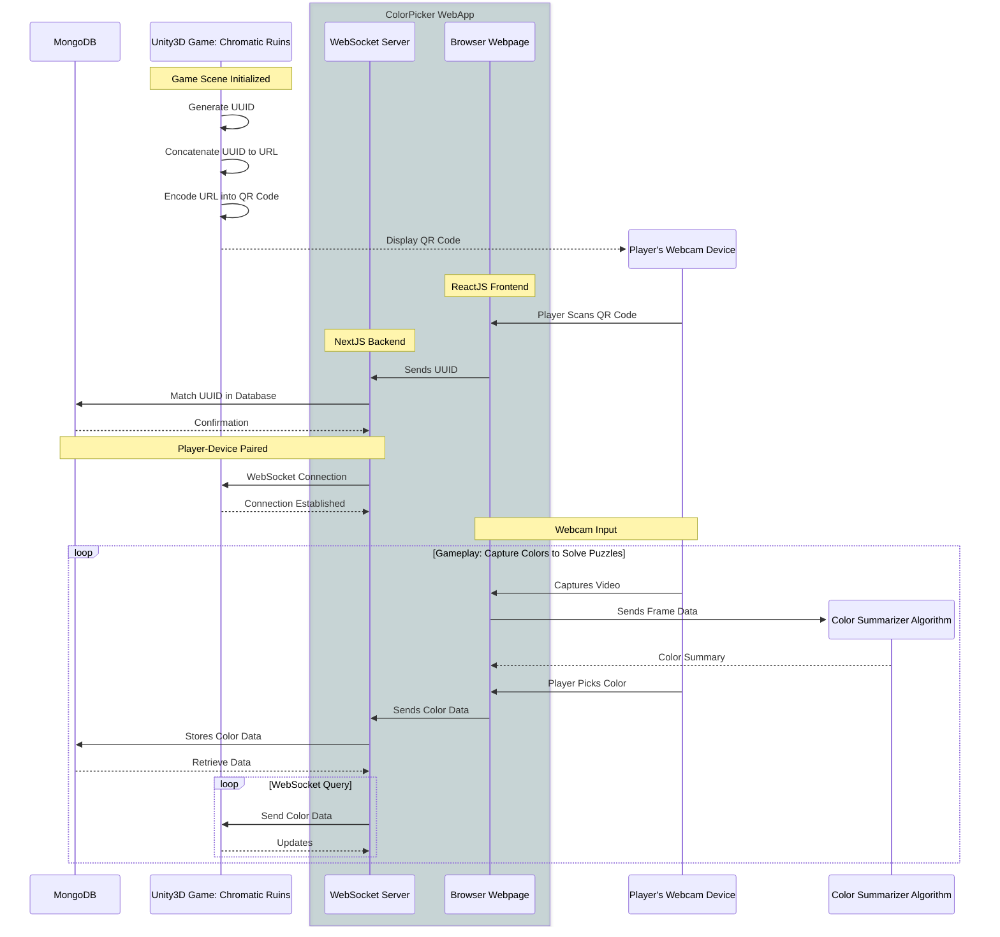

# Webcam Color Picker for Chromatic Ruins

A Next.js and React.js powered web application designed for the interactive game **Chromatic Ruins**, enabling players to extract real-world colors via webcam and integrate them into gameplay mechanics.

## Project Overview

The Webcam ColorPicker tool enhances player immersion by allowing real-time extraction of colors from the player's environment. Colors captured through the webcam directly influence puzzle-solving gameplay within the Unity3D-based game Chromatic Ruins.

## Workflow Diagram



## Technical Stack

- **Frontend:** ReactJS
- **Backend/API:** NextJS, WebSocket
- **Database:** MongoDB
- **Game Engine:** Unity3D
- **Image Processing:** Color Summarizer Algorithm

## Getting Started

First, install dependencies and start the development server:

```bash
npm run dev
# or
yarn dev
# or
pnpm dev
```

Open [http://localhost:3000](http://localhost:3000) in your browser to view the application.

You can edit pages by modifying `pages/index.js`. The page auto-updates as you edit.

API routes are accessible at [http://localhost:3000/api](http://localhost:3000/api).

## Deployment

The easiest deployment method is using [Vercel Platform](https://vercel.com/new?utm_medium=default-template&filter=next.js&utm_source=create-next-app&utm_campaign=create-next-app-readme).

See the [Next.js deployment documentation](https://nextjs.org/docs/deployment) for more details.

## Learn More

Explore Next.js resources to deepen your understanding:

- [Next.js Documentation](https://nextjs.org/docs)
- [Learn Next.js](https://nextjs.org/learn)

Feedback and contributions are welcome via the [Next.js GitHub repository](https://github.com/vercel/next.js/).

